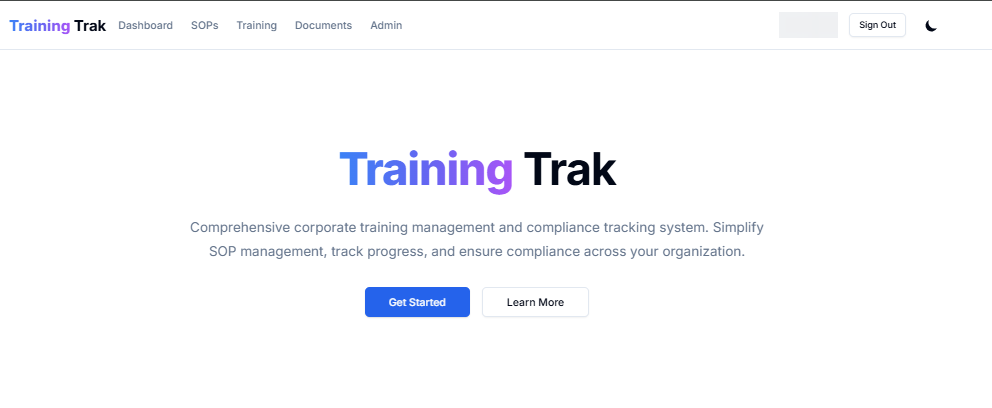
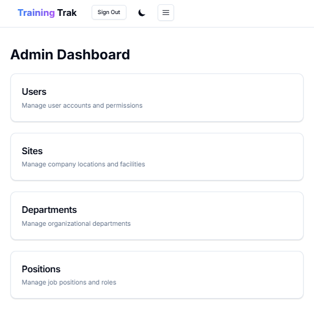

# Training Tracker

A corporate web application designed to manage and track training compliance across multiple locations. This platform facilitates role-based training assignments, monitors progress, and ensures associates meet Standard Operating Procedures (SOP) requirements.



## Features

- **User Management**

  - Role-based access control (Associates, Supervisors, Managers, Admins)
  - Department-based organization
  - User profile management

- **Training & SOP Management**

  - Assign SOPs to specific roles
  - Track completion status
  - Version control for SOPs
  - Document management system

- **Administrative Dashboard**
  - Comprehensive admin panel for user management
  - Department and position configuration
  - Site-wide settings control



- **Document Management**
  - Upload and organize training materials
  - Manage signature sheets
  - SOP document versioning

## Tech Stack

- **Frontend**: Next.js 14
- **Backend**: Prisma ORM with Neon.tech database
- **Authentication**: NextAuth with email/password
- **Styling**: Tailwind CSS with dark/light mode support

## Getting Started

1. Clone the repository
2. Install dependencies:

```bash
npm install
```

3. Set up your environment variables:

```bash
# Create a .env file with:
DATABASE_URL="your-neon-db-url"
NEXTAUTH_SECRET="your-secret"
NEXTAUTH_URL="http://localhost:3000"
```

4. Run database migrations:

```bash
npx prisma migrate dev
```

5. Start the development server:

```bash
npm run dev
```

Open [http://localhost:3000](http://localhost:3000) to view the application.

## Key Features

### For Associates

- View assigned training materials
- Track training progress
- Access department-specific SOPs
- Document completion status

### For Supervisors

- Monitor department compliance
- Manage team training progress
- Access departmental reports

### For Administrators

- Full user management
- SOP and training assignment
- Site and department configuration
- System-wide settings control

## Security

- Role-based access control (RBAC)
- Secure password hashing
- Protected API routes
- Session management

## License

MIT License - see LICENSE file for details
